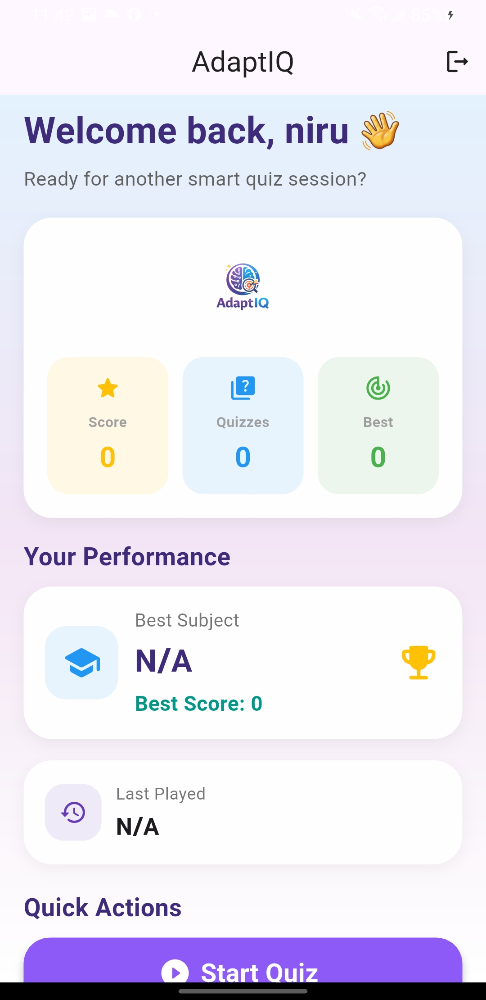
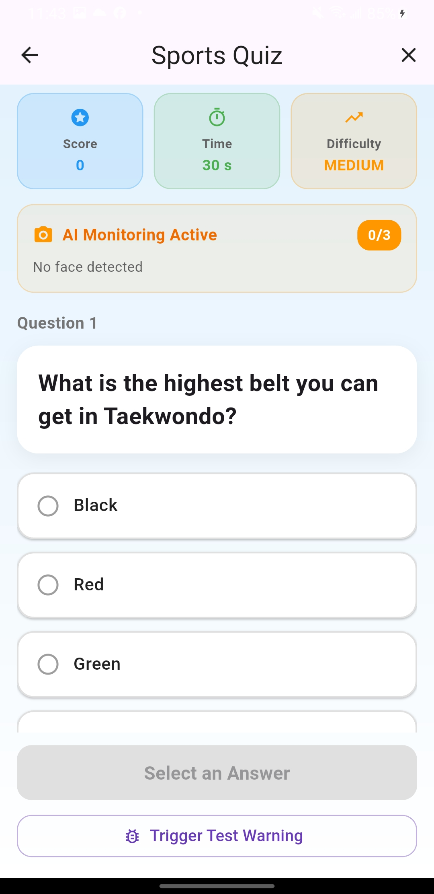
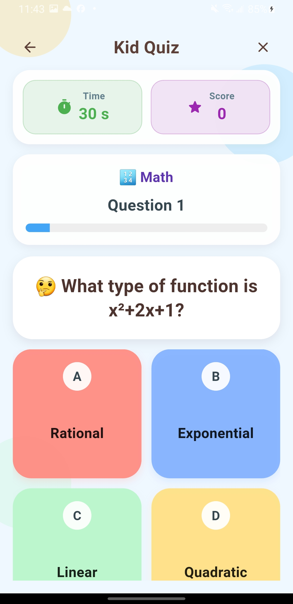

# 🎯 AdaptIQ – Adaptive Quiz Application


## 📖 Overview

AdaptIQ is an adaptive mobile quiz application developed as a Final Year Project. The system dynamically adjusts quiz difficulty based on user performance and includes a camera-based monitoring system using OpenCV.

The application aims to provide a more personalized and engaging learning experience compared to traditional static quiz platforms.

---

## 🚀 Features

### 🔐 Authentication

* JWT-based authentication
* User registration and login
* Persistent login using SharedPreferences

### 🧠 Adaptive Learning

* Rule-based adaptive difficulty system
* Difficulty increases after consecutive correct answers
* Difficulty decreases after consecutive incorrect answers
* Dynamic score calculation

### 👶 Kid Mode

* Child-friendly interface
* Simplified quiz experience
* Independent timer management

### 📊 Dashboard

* Quiz statistics
* User performance tracking
* Session history

### 👁️ Monitoring System

* OpenCV integration
* Haar Cascade face detection
* Warning system
* Quiz integrity monitoring

---

## 📸 Screenshots

### Dashboard


### Quiz Interface


### Kid Mode


### Monitoring System


---

## 🏗️ System Architecture

Flutter Mobile App
↓
REST API (HTTP/JSON)
↓
Django REST Framework
↓
PostgreSQL Database

Monitoring Module:
Flutter Camera
↓
MethodChannel
↓
Kotlin
↓
OpenCV + Haar Cascade

---

## 🛠️ Technologies Used

### Frontend

* Flutter
* Dart
* Provider State Management

### Backend

* Django
* Django REST Framework
* SimpleJWT

### Database

* PostgreSQL

### Computer Vision

* OpenCV
* Haar Cascade Classifier

---

## 📂 Project Structure

frontend/
├── lib/
│ ├── screens/
│ ├── services/
│ ├── providers/
│ └── main.dart

backend/
├── AdaptIQ/
│ ├── views.py
│ ├── models.py
│ ├── urls.py
│ └── admin.py
└── manage.py

---

## 🔑 Key Learning Outcomes

* Mobile application development with Flutter
* REST API development using Django
* JWT authentication implementation
* Database design with PostgreSQL
* Adaptive learning algorithms
* OpenCV integration for monitoring

---

## 🔮 Future Improvements

* AI-powered adaptive learning
* MediaPipe-based monitoring
* Cloud deployment
* Advanced analytics dashboard
* Leaderboard system

---

📋 Prerequisites

Before running the project, ensure the following software is installed:

*Python 3.10+
*Flutter SDK
*PostgreSQL
*Git

---

## ⚙️ Installation

### Clone Repository

```bash
git clone https://github.com/YOUR_USERNAME/AdaptIQ.git
cd AdaptIQ
```

### Backend Setup

```bash
cd backend
pip install -r requirements.txt
python manage.py migrate
python manage.py runserver
```

### Frontend Setup

```bash
cd frontend
flutter pub get
flutter run
```

### Database

Configure PostgreSQL credentials in Django settings before running migrations.

### Notes

* Backend must be running before starting the Flutter application.
* For physical device testing, update the API base URL to your machine's local IP address.

---

## 👨‍💻 Author

**Nirupam Aryal**

Final Year Project – BSc (Hons) Computing
